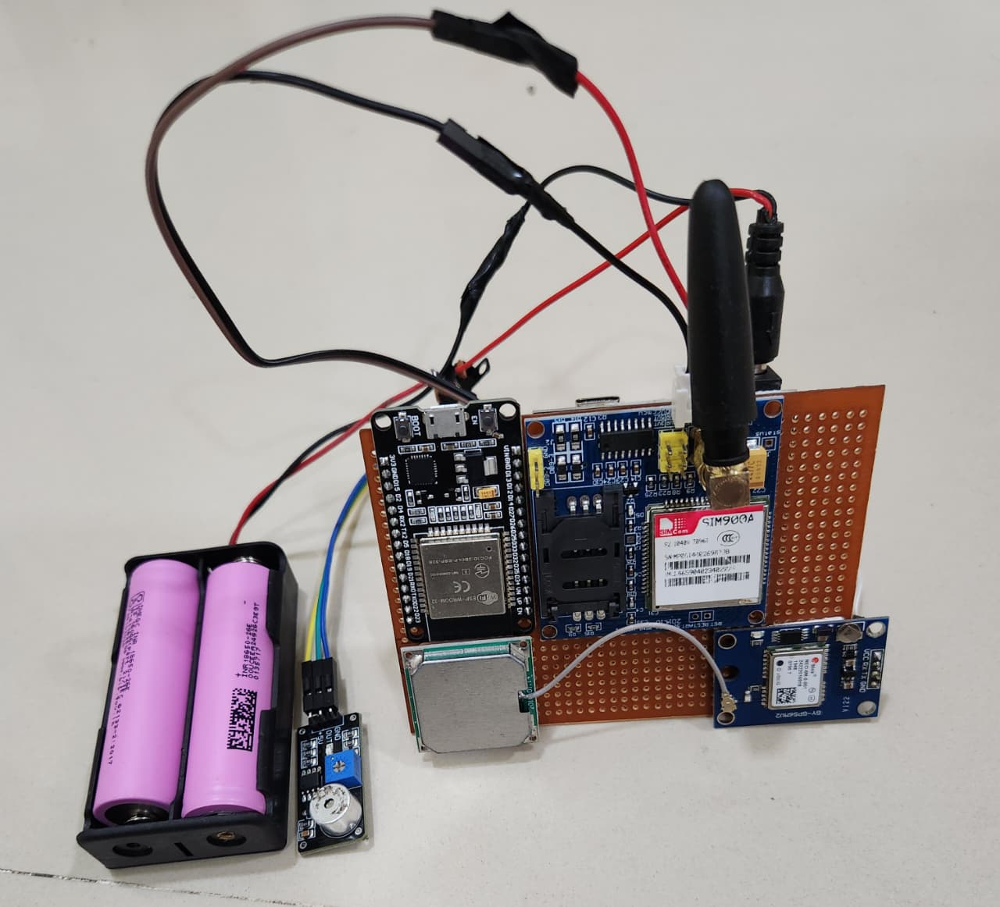
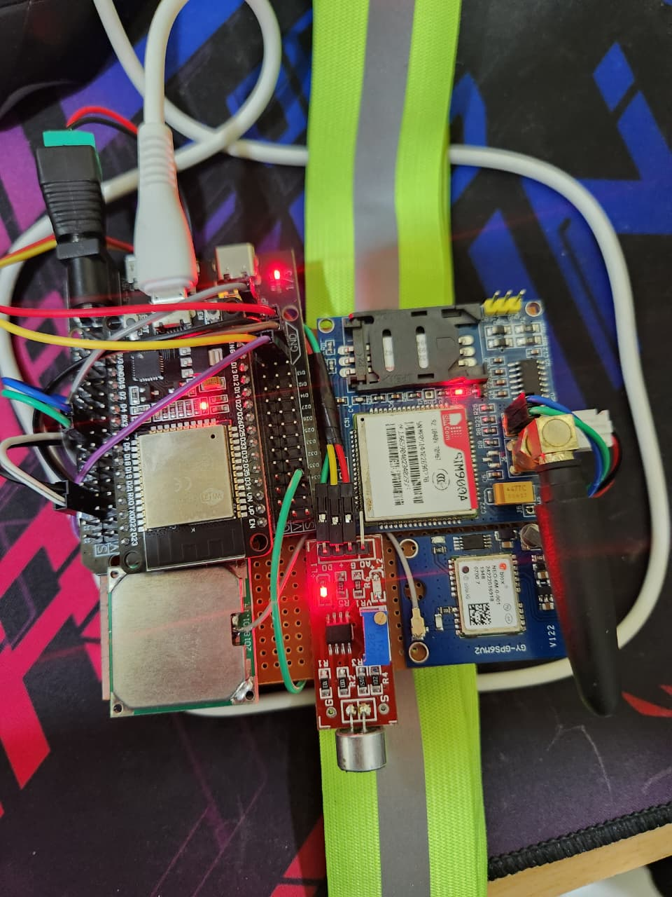

# 🐾 Animal Safety Belt — Smart Pet Safety System

### 📡 ESP32 | GSM SIM900A | GPS NEO-6M | Sound Sensor

---

## 📝 Overview

The **Animal Safety Belt** is a smart IoT-based safety device designed for pets.  
It detects distress sounds (like high-pitched squeaks or barks) using a **sound sensor**, and when triggered, it automatically sends the **pet’s GPS location** to the owner’s phone via **GSM module**.

This ensures the owner can locate and assist their pet quickly in emergency or distress situations.

---

## 🎯 Key Features

- 🐶 Detects distress sounds from the animal using a **sound sensor**
- 🌍 Tracks live location using **NEO-6M GPS Module**
- 📱 Sends **SMS alerts** through **SIM900A GSM Module**
- ⚙️ Operated by **ESP32 microcontroller**
- 🔋 Compact, battery-powered, and wearable as a pet belt
- 💬 Adjustable frequency and amplitude thresholds for detection sensitivity

---

## 🧠 Working Principle

1. The **sound sensor** continuously monitors the dog’s sounds.  
2. When the frequency crosses a predefined threshold (e.g., 1200 Hz), the ESP32 identifies it as a distress signal.  
3. The **GPS module (NEO-6M)** provides real-time coordinates.  
4. The **GSM module (SIM900A)** sends an alert message to the owner's registered phone number.  
5. The SMS contains both a **warning message** and the **exact GPS coordinates** of the dog.

---

## 🧩 Components Used

| Component | Description |
|------------|-------------|
| **ESP32** | Main microcontroller that controls GSM and GPS |
| **SIM900A GSM Module** | Sends SMS alerts to the pet owner |
| **NEO-6M GPS Module** | Provides real-time GPS location |
| **Sound Sensor (KY-037 or equivalent)** | Detects sound intensity and triggers alerts |
| **Li-ion / Li-Po Battery** | Power source for portable use |
| **Pet Belt / Harness** | Used to mount all modules securely on the pet |

---

## 🔌 Circuit Connections

| Module | ESP32 Pin | Description |
|--------|------------|-------------|
| **GSM RX** | GPIO17 | Transmit from ESP32 to GSM |
| **GSM TX** | GPIO16 | Receive from GSM to ESP32 |
| **GPS RX** | GPIO5 | Transmit from ESP32 to GPS |
| **GPS TX** | GPIO4 | Receive from GPS to ESP32 |
| **Sound Sensor OUT** | GPIO34 | Analog input for sound detection |
| **VCC** | 3.3V / 5V (as per module) | Power supply |
| **GND** | Common Ground | Ground connection for all modules |

---

## ⚙️ Setup & Operation

1. Assemble all modules on the pet’s belt securely.  
2. Connect wiring as shown in the **Circuit Connections** table above.  
3. Upload the Arduino code to the **ESP32** via **Arduino IDE**.  
4. Insert a valid SIM card with SMS balance into the GSM module.  
5. Power the system using a rechargeable battery.  
6. When the dog makes a distress sound, the system will:
   - Detect sound frequency using the sound sensor  
   - Fetch GPS coordinates  
   - Send SMS alert with location link to the owner’s phone  

---

## 💬 Example SMS Output

---

## 📸 Screenshots & Demo

### 🐕 SMS Alert Received
> Add your screenshots below (rename files before uploading)

| Screenshot | Description |
|-------------|-------------|
|  | SMS received on owner's phone showing GPS data |
|  | SMS with Google Maps link for quick location tracking |

---

### ⚙️ Hardware Setup
> Add photos of your actual hardware setup

| Image | Description |
|--------|-------------|
|  | Modules attached to the animal safety belt |
|  | Close view of ESP32, GPS, and GSM module connections |

---

### 🔌 Circuit Diagram
> Add your circuit layout image here

| Diagram | Description |
|----------|-------------|
|  | Pin connection layout for ESP32 + GSM + GPS + Sound Sensor |

---

## 🚀 Future Enhancements

- 🩺 Add health sensors (temperature, heart rate)  
- 🌐 Add live GPS tracking using an IoT web dashboard  
- 🔋 Integrate solar or wireless charging  
- 📲 Add Bluetooth app configuration for owner setup  

---

## 👩‍🔬 Developed By

**Harshvardhan Sanjay Pandhare & Team**  
📅 IoT Safety Innovation Project — 2025  

---

## 📄 License

Licensed under the **MIT License** — free to use, modify, and share with credit.

---

## 💖 Acknowledgment

Special thanks to all contributors, mentors, and test pets 🐕 who made this project possible!

